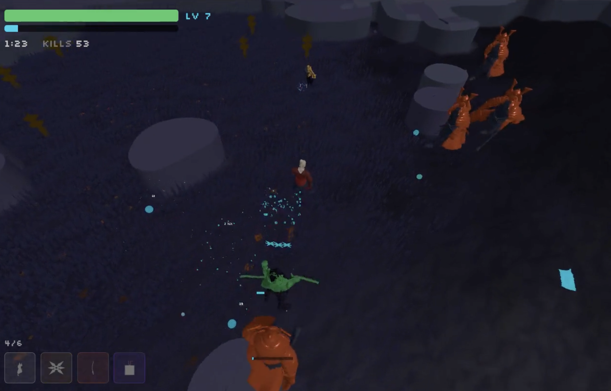

# Bullet Factory



Give it a prompt, get a playable 3D Vampire Survivors-like game for iOS.

A coding agent (Claude) autonomously develops each game by following an [SOP](https://en.wikipedia.org/wiki/Standard_operating_procedure) checklist through three phases: **pre-production** (creative decisions), **grayboxing** (core mechanics with placeholder art), and **asset generation** (3D meshes, music, sound effects). The user only intervenes at review gates.

For a detailed walkthrough: [Bullet Factory: 3D games created on a prompt](https://ulyssepence.com/blog/post/bullet-factory-3d-games-created-on-a-prompt)

## Quick Start

```bash
npm install
npm run new samurai "You are a samurai, fighting off the ghosts of your fallen comrades"
python3 sop.py games/samurai/SOP.md
```

## Structure

```
template/         SOP checklist + game engine skeleton (copied per game)
patterns/         Implementation guides (level gen, particles, progression, ...)
scripts/          Build, scaffold, asset generation, previews
tools/            Standalone dev tools (see below)
games/<slug>/     Each generated game
fonts/            Curated + labeled font library
gdc/              Scripts for building a semantic search index over GDC talks
```

## Commands

| Command | |
|---|---|
| `npm run new <slug> [prompt]` | Scaffold + launch SOP session |
| `npm run dev <slug>` | Dev server |
| `npm run build:ios <slug>` | iOS build via Capacitor |
| `npm run smoke-test <slug>` | Headless Playwright test |
| `npm run generate-music <slug>` | AI music generation |
| `npx tsx scripts/generate-meshes.ts` | 3D mesh generation via Meshy |

## Dev Tools (`tools/`)

Visual tools for verifying and tuning subsystems the agent builds:

- **level-ca / level-heightmap** -- cellular automata and 3D terrain generation
- **pathfinding** -- flow-field navigation with spatial hashing
- **grass** -- GPU-instanced foliage via procedural shaders
- **mesh-generation** -- palette-based region coloring for generated 3D meshes
- **particle-demo** -- particle system presets
- **post-processing** -- screen-space shader effects
- **audio-sfx / audio-music** -- sound selection and music crossfade
- **palette-picker** -- cosine palette generation with OKLab perceptual validation
- **profile** -- in-game CPU/GPU profiling overlay

This separation exists because an agent that fills its context with implementation work becomes worse at following meta-instructions.
